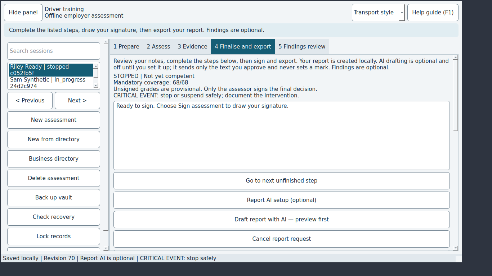

# JEV-0001: Mouse wheel over the Mark dropdown can set CF and permanently stop the session with no confirmation

| | |
|---|---|
| Status | open |
| Severity / category | high / data-loss |
| Classification | confirmed bug (confidence: confirmed) |
| Priority | 180.0 (rank 1) |
| Seen | 1 time(s) in 1 run(s); first 2026-09-29T06:09:30, last 2026-09-29T06:09:30 |
| Reported by | scenario |
| DT commits | 6ead5563ebbf |

## What happens

**Expected:** Wheel scrolling over the Mark dropdown does not change the mark (or CF asks for confirmation), and returning the mark leaves the outcome unchanged.

**Actual:** Four wheel notches move C -> D -> NYC -> NA -> CF with autosave; the record becomes STOPPED / Not yet competent and stays so after the mark is changed back.

## Reproduce

1. Start DT with seed=sample (Jev seed/network options).
2. Select the row "Riley Ready"
3. Open the "2 Assess" tab
4. Select the row "E02.02" in "Observable checks"
5. Turn the mouse wheel down 4 notch(es) over "Mark"
6. Turn the mouse wheel up 4 notch(es) over "Mark"
7. Wait up to 1 s
8. Open the "4 Finalise" tab

Replay with Jev: `jev scenario run regressions/mark-wheel-critical-failure` (copy in `scenarios/JEV-0001.json`).

## Where to look

- dt/ui.py: MainWindow.mark_box QComboBox accepts wheel events without focus
- dt/drafts.py: DraftBuffer.mark keeps state 'stopped' once any CF was recorded
- `dt/ui.py:748` in `MainWindow.mark_box`: named in the issue: dt/ui.py: MainWindow.mark_box QComboBox accepts wheel events without focus
- `dt/drafts.py:47` in `DraftBuffer.mark`: named in the issue: dt/drafts.py: DraftBuffer.mark keeps state 'stopped' once any CF was recorded

`dt/ui.py` around line 748:

```python
  748      def mark_box(self):
  749          box = QGroupBox("Mark")
  750          layout = QVBoxLayout(box)
  751          self.mark_choice = QComboBox()
  752          for mark, description in MARK_DESCRIPTIONS.items():
  753              self.mark_choice.addItem(mark.value)
  754              self.mark_choice.setItemData(self.mark_choice.count() - 1, description, Qt.ItemDataRole.ToolTipRole)
  755          self.mark_description = QLabel(MARK_DESCRIPTIONS[Mark.NOT_OBSERVED])
  756          self.mark_description.setWordWrap(True)
  757          self.mark_choice.currentTextChanged.connect(self.show_mark_description)
  758          layout.addWidget(self.mark_choice)
  759          layout.addWidget(self.mark_description)
  760          self.mark_key = QLabel("Key\n" + "\n".join(f"{mark.value} = {description}"
  761                                                     for mark, description in MARK_DESCRIPTIONS.items()))
  762          self.mark_key.setWordWrap(True)
  763          self.mark_key.setVisible(False)
  764          key_button = QPushButton("Show mark key")
```

`dt/drafts.py` around line 47:

```python
   47      def mark(self, criterion_id, mark, observation, reason, parameters=None):
   48          self.editable()
   49          if criterion_id not in {c.id for c in self.current.criteria}:
   50              raise ValueError("Unknown criterion")
   51          mark = Mark(mark).value
   52          parameters = dict(parameters or {})
   53          previous = self.current.results.get(criterion_id, Result())
   54          if (previous.mark, previous.observation, previous.applicability_reason,
   55                  previous.parameters) == (mark, observation, reason, parameters):
   56              return
   57          if criterion_id in self.current.assessment.get("scope", {}).get("exclusions", {}):
   58              raise ValueError("Restore the excluded criterion before recording another attempt")
   59          from .modular_assessment import capture_attempt, start_assessment
   60          start_assessment(self.current)
   61          if previous.mark != mark and previous.mark in (Mark.CRITICAL, Mark.DEVELOPING, Mark.NOT_COMPETENT):
   62              capture_attempt(self.current, criterion_id, previous)
   63          result = deepcopy(previous)
```

## Evidence



Runs: campaign-baseline/verify/JEV-0001-mark-wheel-critical-failure (scenario, scenario)

## Suggested DT regression test

tests/desktop/test_ui.py: open a check on 2 Assess, send QWheelEvents to window.mark_choice without giving it focus, and assert the mark and outcome are unchanged. Also assert that choosing CF asks for confirmation before the session stops.

## Definition of done

1. The fix is on a DT branch with a DT regression test that fails without it.
2. `JEV_DT_PATH=<that checkout> jev verify --issue JEV-0001` passes.
3. The next `jev campaign` does not report it again.

## Task for a coding agent in the DT repository

```text
Fix JEV-0001 in DT: Mouse wheel over the Mark dropdown can set CF and permanently stop the session with no confirmation.
Expected: Wheel scrolling over the Mark dropdown does not change the mark (or CF asks for confirmation), and returning the mark leaves the outcome unchanged.
Actual: Four wheel notches move C -> D -> NYC -> NA -> CF with autosave; the record becomes STOPPED / Not yet competent and stays so after the mark is changed back.
Start from: dt/ui.py:748 (MainWindow.mark_box), dt/drafts.py:47 (DraftBuffer.mark).
Work on a branch, follow DT's own AGENTS.md, and add a regression test that fails before the fix (tests/desktop/test_ui.py: open a check on 2 Assess, send QWheelEvents to window.mark_choice without giving it focus, and assert the mark and outcome are unchanged. Also assert that choosing CF asks for confirmation before the session stops.).
Run DT's unit and desktop test suites before finishing.
```
