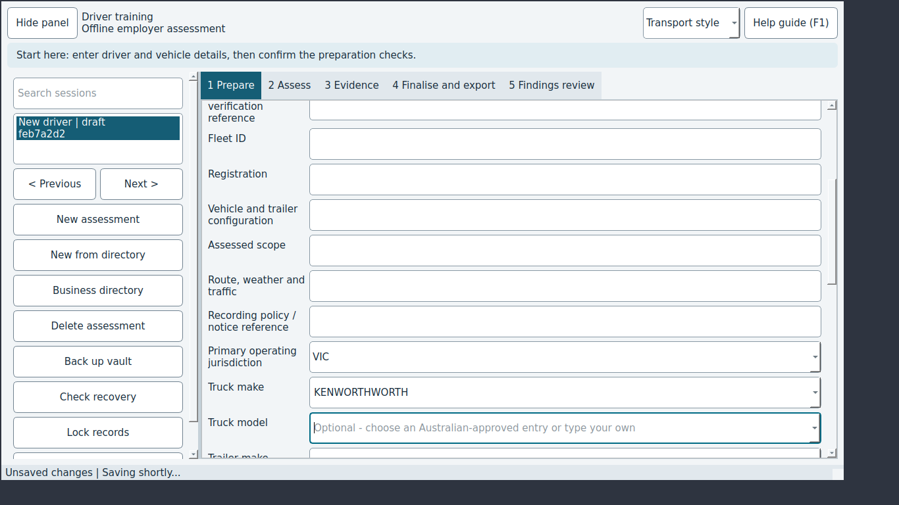

# JEV-0002: Typing a truck make key by key saves a corrupted value (KENWORTH becomes KENWORTHWORTH)

| | |
|---|---|
| Status | open |
| Severity / category | high / functional |
| Classification | confirmed bug (confidence: confirmed) |
| Priority | 132.0 (rank 2) |
| Seen | 1 time(s) in 1 run(s); first 2026-09-29T06:09:34, last 2026-09-29T06:09:34 |
| Reported by | scenario |
| DT commits | 6ead5563ebbf |

## What happens

**Expected:** After typing KENWORTH and pressing Tab, Truck make is KENWORTH and no 'not in the register' note appears.

**Actual:** The field holds KENWORTHWORTH ('Ken' gives 'KenT KENWORTH'), and DT records that value.

## Reproduce

1. Start DT with seed=empty (Jev seed/network options).
2. Click "New assessment"
3. Type "KENWORTH" into "Truck make" and press Tab

Replay with Jev: `jev scenario run regressions/truck-make-inline-completion` (copy in `scenarios/JEV-0002.json`).

## Where to look

- dt/ui.py: MainWindow.searchable_combo sets Qt.MatchContains on the editable combo's default InlineCompletion completer
- `dt/ui.py:640` in `MainWindow.searchable_combo`: named in the issue: dt/ui.py: MainWindow.searchable_combo sets Qt.MatchContains on the editable combo's defaul
- `dt/ui.py:653` in `MainWindow.vehicle_rows`: string text 'Truck make'
- `dt/reports.py:66` in ``: string text 'Truck make'

`dt/ui.py` around line 640:

```python
  640      def searchable_combo(options, placeholder):
  641          """A long list needs type-ahead matching and must not widen the page to its longest entry."""
  642          combo = MainWindow.custom_combo(options, placeholder)
  643          combo.setSizeAdjustPolicy(QComboBox.SizeAdjustPolicy.AdjustToMinimumContentsLengthWithIcon)
  644          combo.setMinimumContentsLength(10)
  645          combo.setSizePolicy(QSizePolicy.Policy.Expanding, QSizePolicy.Policy.Fixed)
  646          combo.completer().setCaseSensitivity(Qt.CaseSensitivity.CaseInsensitive)
  647          combo.completer().setFilterMode(Qt.MatchFlag.MatchContains)
  648          return combo
  649  
  650      def vehicle_rows(self, layout):
  651          """Optional Australian make, model and trailer type choices; a typed entry is kept as typed."""
  652          self.vehicle_choices = {}
  653          for key, label, kind in [("truck_make", "Truck make", "truck"), ("truck_model", "Truck model", "truck"),
  654                                   ("trailer_make", "Trailer make", "trailer"),
  655                                   ("trailer_model", "Trailer model", "trailer")]:
  656              options = vehicles.makes(kind) if key.endswith("_make") else []
```

`dt/ui.py` around line 653:

```python
  648          return combo
  649  
  650      def vehicle_rows(self, layout):
  651          """Optional Australian make, model and trailer type choices; a typed entry is kept as typed."""
  652          self.vehicle_choices = {}
  653          for key, label, kind in [("truck_make", "Truck make", "truck"), ("truck_model", "Truck model", "truck"),
  654                                   ("trailer_make", "Trailer make", "trailer"),
  655                                   ("trailer_model", "Trailer model", "trailer")]:
  656              options = vehicles.makes(kind) if key.endswith("_make") else []
  657              self.vehicle_choices[key] = self.searchable_combo(
  658                  options, "Optional - choose an Australian-approved entry or type your own")
  659              layout.addRow(label, self.vehicle_choices[key])
```

## Evidence



Runs: campaign-baseline/verify/JEV-0002-truck-make-inline-completion (scenario, scenario)

## Suggested DT regression test

tests/desktop/test_vehicle_ui.py: combo = window.vehicle_choices['truck_make']; focus it, QTest.keyClicks(combo.lineEdit(), 'KENWORTH'), press Tab, then assert combo.currentText() == 'KENWORTH' and that the saved preparation holds 'KENWORTH'.

## Definition of done

1. The fix is on a DT branch with a DT regression test that fails without it.
2. `JEV_DT_PATH=<that checkout> jev verify --issue JEV-0002` passes.
3. The next `jev campaign` does not report it again.

## Task for a coding agent in the DT repository

```text
Fix JEV-0002 in DT: Typing a truck make key by key saves a corrupted value (KENWORTH becomes KENWORTHWORTH).
Expected: After typing KENWORTH and pressing Tab, Truck make is KENWORTH and no 'not in the register' note appears.
Actual: The field holds KENWORTHWORTH ('Ken' gives 'KenT KENWORTH'), and DT records that value.
Start from: dt/ui.py:640 (MainWindow.searchable_combo), dt/ui.py:653 (MainWindow.vehicle_rows), dt/reports.py:66 ().
Work on a branch, follow DT's own AGENTS.md, and add a regression test that fails before the fix (tests/desktop/test_vehicle_ui.py: combo = window.vehicle_choices['truck_make']; focus it, QTest.keyClicks(combo.lineEdit(), 'KENWORTH'), press Tab, then assert combo.currentText() == 'KENWORTH' and that the saved preparation holds 'KENWORTH'.).
Run DT's unit and desktop test suites before finishing.
```
