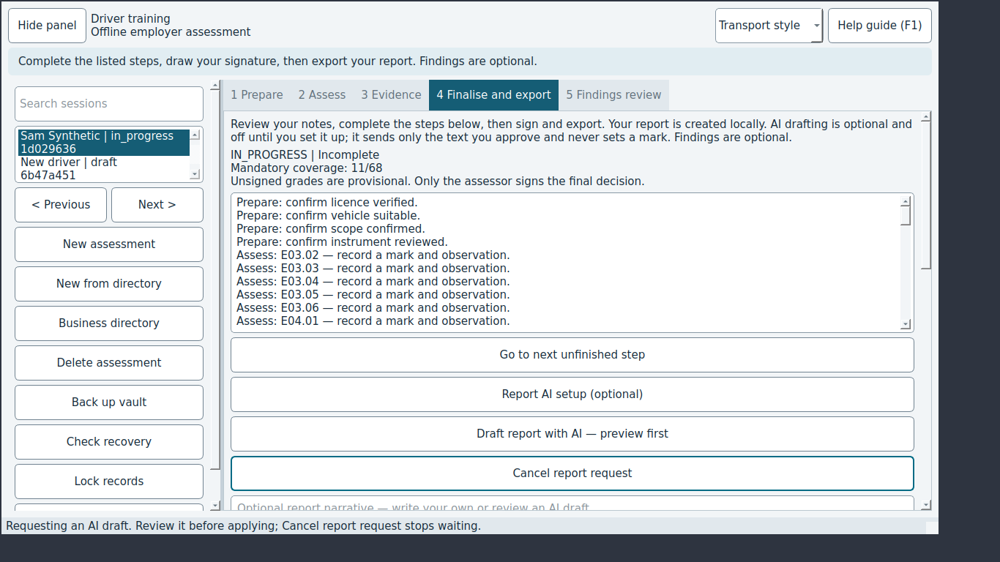

# JEV-0003: Cancel report request does nothing while an AI draft is being requested

| | |
|---|---|
| Status | open |
| Severity / category | high / functional |
| Classification | confirmed bug (confidence: confirmed) |
| Priority | 132.0 (rank 3) |
| Seen | 2 time(s) in 2 run(s); first 2026-09-29T06:06:05, last 2026-09-29T06:09:02 |
| Reported by | scenario |
| DT commits | 6ead5563ebbf |

## What happens

**Expected:** Cancel report request stops waiting at once and the status bar says the request was cancelled (README promise).

**Actual:** The click is ignored until the provider answers.

## Reproduce

1. Start DT with seed=sample, network=mock (Jev seed/network options).
2. Select the row "Sam Synthetic"
3. Open the "4 Finalise" tab
4. Click "Report AI setup (optional)"
5. Choose "OpenRouter" in "Provider"
6. Type "bad model id with spaces" into "Model"
7. Type "sk-or-v1-synthetic" into "API key / Copilot access token"
8. Click "Save"
9. Click "Draft report with AI"
10. Click "OK"
11. Click "Report AI setup (optional)"
12. Type "x-ai/grok-4.7" into "Model"
13. Click "Save"
14. Click "Draft report with AI"
15. Check the screen
16. Tick "Include my recorded observations"
17. Untick "Include my recorded observations"
18. Click "Send approved text"
19. Click "Use reviewed draft"
20. Check the screen
21. (harness) make the mocked ai service answer 'http_429'
22. Click "Draft report with AI"
23. Click "Send approved text"
24. (harness) make the mocked ai service answer 'unfinished'
25. Click "Draft report with AI"
26. Click "Send approved text"
27. (harness) make the mocked ai service answer 'long_draft'
28. Click "Draft report with AI"
29. Click "Send approved text"
30. (harness) make the mocked ai service answer 'injection'
31. Click "Draft report with AI"
32. Click "Send approved text"
33. Click "Cancel" in the "Review AI report draft" window
34. (harness) make the mocked ai service answer 'slow'
35. Click "Draft report with AI"
36. Click "Send approved text"
37. Click "Cancel report request"

Replay with Jev: `jev scenario run regressions/cancel-report-request` (copy in `scenarios/JEV-0003.json`).

## Where to look

- dt/ui.py: finalise_tab wires 'Cancel report request' through MainWindow.button -> run_action, which returns while busy()
- `dt/ui.py:960` in `MainWindow.finalise_tab`: named in the issue: dt/ui.py: finalise_tab wires 'Cancel report request' through MainWindow.button -> run_acti
- `dt/ui.py:567` in `MainWindow.button`: named in the issue: dt/ui.py: finalise_tab wires 'Cancel report request' through MainWindow.button -> run_acti
- `dt/ui.py:1429` in `MainWindow.draft_report`: status text 'Requesting an AI draft. Review it before applying; Cancel re'
- `dt/ui.py:978` in `MainWindow.finalise_tab`: button text 'Requesting an AI draft. Review it before applying; Cancel re'

`dt/ui.py` around line 960:

```python
  960      def finalise_tab(self):
  961          page = QWidget()
  962          layout = QVBoxLayout(page)
  963          report_note = QLabel("Review your notes, complete the steps below, then sign and export. "
  964                               "Your report is created locally. AI drafting is optional and off until you set it up; "
  965                               "it sends only the text you approve and never sets a mark. Findings are optional.")
  966          report_note.setWordWrap(True)
  967          layout.addWidget(report_note)
  968          self.summary = QLabel()
  969          self.summary.setWordWrap(True)
  970          layout.addWidget(self.summary)
  971          self.signing_checklist = QListWidget()
  972          self.signing_checklist.setAccessibleName("Steps remaining before signing")
  973          self.signing_checklist.itemActivated.connect(self.open_signing_step)
  974          layout.addWidget(self.signing_checklist)
  975          self.button("Go to next unfinished step", self.next_signing_step, layout)
  976          self.button("Report AI setup (optional)", self.setup_report_ai, layout)
```

`dt/ui.py` around line 567:

```python
  567      def button(self, label, callback, layout):
  568          button = QPushButton(label)
  569          button.clicked.connect(lambda: self.run_action(callback))
  570          layout.addWidget(button)
  571          return button
  572  
  573      def run_action(self, callback):
  574          if self.locked or self.busy():
  575              return
  576          try:
  577              if self.session is None:
  578                  raise ValueError("Create or select an assessment first")
  579              if not self.flush_edits():
  580                  raise ValueError("Save failed. Your edits are retained; retry before continuing.")
  581              callback()
  582          except Exception as error:
  583              QMessageBox.warning(self, "Action requires attention", str(error))
```

## Evidence



Runs: campaign-baseline/sweep/09-ai-report (scenario, scenario); campaign-baseline/verify/JEV-0003-cancel-report-request (scenario, scenario)

## Suggested DT regression test

tests/desktop/test_ui.py: patch the report provider so the request blocks on a threading.Event, call draft_report, click the 'Cancel report request' button while busy() is true, and assert the status bar says the request was cancelled and a late reply is discarded.

## Definition of done

1. The fix is on a DT branch with a DT regression test that fails without it.
2. `JEV_DT_PATH=<that checkout> jev verify --issue JEV-0003` passes.
3. The next `jev campaign` does not report it again.

## Task for a coding agent in the DT repository

```text
Fix JEV-0003 in DT: Cancel report request does nothing while an AI draft is being requested.
Expected: Cancel report request stops waiting at once and the status bar says the request was cancelled (README promise).
Actual: The click is ignored until the provider answers.
Start from: dt/ui.py:960 (MainWindow.finalise_tab), dt/ui.py:567 (MainWindow.button), dt/ui.py:1429 (MainWindow.draft_report).
Work on a branch, follow DT's own AGENTS.md, and add a regression test that fails before the fix (tests/desktop/test_ui.py: patch the report provider so the request blocks on a threading.Event, call draft_report, click the 'Cancel report request' button while busy() is true, and assert the status bar says the request was cancelled and a late reply is discarded.).
Run DT's unit and desktop test suites before finishing.
```
