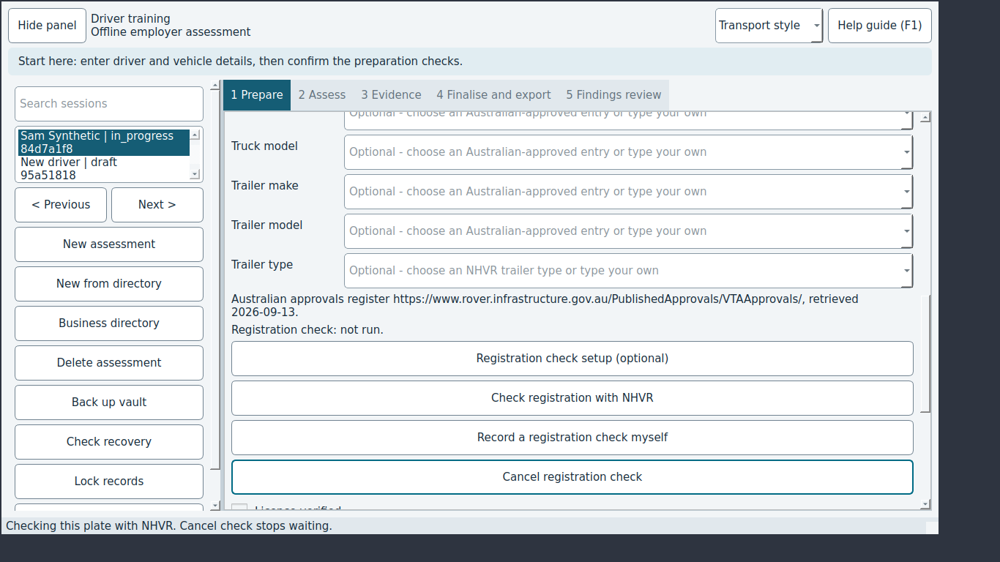

# JEV-0004: Cancel registration check does nothing while the NHVR request is running

| | |
|---|---|
| Status | open |
| Severity / category | medium / functional |
| Classification | confirmed bug (confidence: confirmed) |
| Priority | 66.0 (rank 5) |
| Seen | 1 time(s) in 1 run(s); first 2026-09-29T06:08:41, last 2026-09-29T06:08:41 |
| Reported by | scenario |
| DT commits | 6ead5563ebbf |

## What happens

**Expected:** Cancel registration check stops waiting at once and says so.

**Actual:** The click is ignored until NHVR answers.

## Reproduce

1. Start DT with seed=sample, network=mock (Jev seed/network options).
2. Select the row "Sam Synthetic"
3. Click "Registration check setup (optional)"
4. Type "jev-synthetic-key-123" into "NHVR subscription key"
5. Click "Save"
6. (harness) make the mocked nhvr service answer 'slow'
7. Click "Check registration with NHVR"
8. Click "Send this plate"
9. Click "Cancel registration check"

Replay with Jev: `jev scenario run regressions/cancel-registration-check` (copy in `scenarios/JEV-0004.json`).

## Where to look

- dt/ui.py: registration_rows connects every button, including Cancel registration check, through run_action, which returns while busy()
- dt/registration.py: get_json blocks in opener.open for up to 15 s, so even a wired button would wait
- `dt/ui.py:672` in `MainWindow.registration_rows`: named in the issue: dt/ui.py: registration_rows connects every button, including Cancel registration check, th
- `dt/ui.py:1845` in `MainWindow.busy`: named in the issue: dt/ui.py: registration_rows connects every button, including Cancel registration check, th
- `dt/registration.py:77` in `get_json`: named in the issue: dt/registration.py: get_json blocks in opener.open for up to 15 s, so even a wired button 
- `dt/ui.py:680` in `MainWindow.registration_rows`: string text 'Cancel registration check'
- `dt/ui.py:1476` in `MainWindow.check_registration`: status text 'Checking this plate with NHVR. Cancel check stops waiting.'

`dt/ui.py` around line 672:

```python
  672      def registration_rows(self, layout):
  673          """Registration is checked against a road authority record, never against the model catalogue."""
  674          self.registration_note = QLabel(describe_check(None))
  675          self.registration_note.setWordWrap(True)
  676          layout.addRow(self.registration_note)
  677          for label, callback in [("Registration check setup (optional)", self.setup_registration),
  678                                  ("Check registration with NHVR", self.check_registration),
  679                                  ("Record a registration check myself", self.record_registration_manually),
  680                                  ("Cancel registration check", self.cancel_import)]:
  681              button = QPushButton(label)
  682              button.clicked.connect(lambda checked=False, action=callback: self.run_action(action))
  683              layout.addRow(button)
  684  
  685      def reload_models(self, kind):
  686          """Offer the models approved for the chosen make without discarding a typed model."""
  687          combo = self.vehicle_choices[f"{kind}_model"]
  688          typed = combo.currentText()
```

`dt/ui.py` around line 1845:

```python
 1845      def busy(self):
 1846          return bool(self.worker and self.worker.isRunning())
 1847  
 1848      def export(self):
 1849          if not self.session.signed_at:
 1850              raise ValueError("Sign the assessment before export")
 1851          recipient, ok = QInputDialog.getText(self, "Authorised recipient", "Who is this management export for?")
 1852          if not ok:
 1853              return
 1854          purpose, ok = QInputDialog.getText(self, "Disclosure purpose", "Purpose of this export:")
 1855          if not ok:
 1856              return
 1857          destination = QFileDialog.getExistingDirectory(self, "Export readable PDF and manifest outside vault")
 1858          if destination:
 1859              path = export_report(self.vault, self.session, destination, recipient, purpose)
 1860              QMessageBox.information(self, "Export verified", str(path))
 1861  
```

## Evidence



Runs: campaign-baseline/verify/JEV-0004-cancel-registration-check (scenario, scenario)

## Suggested DT regression test

tests/desktop/test_vehicle_ui.py: patch registration.get_json (or the opener) to block, start an NHVR check, click 'Cancel registration check' and assert the status says cancelled within a second and no result is recorded.

## Definition of done

1. The fix is on a DT branch with a DT regression test that fails without it.
2. `JEV_DT_PATH=<that checkout> jev verify --issue JEV-0004` passes.
3. The next `jev campaign` does not report it again.

## Task for a coding agent in the DT repository

```text
Fix JEV-0004 in DT: Cancel registration check does nothing while the NHVR request is running.
Expected: Cancel registration check stops waiting at once and says so.
Actual: The click is ignored until NHVR answers.
Start from: dt/ui.py:672 (MainWindow.registration_rows), dt/ui.py:1845 (MainWindow.busy), dt/registration.py:77 (get_json).
Work on a branch, follow DT's own AGENTS.md, and add a regression test that fails before the fix (tests/desktop/test_vehicle_ui.py: patch registration.get_json (or the opener) to block, start an NHVR check, click 'Cancel registration check' and assert the status says cancelled within a second and no result is recorded.).
Run DT's unit and desktop test suites before finishing.
```
