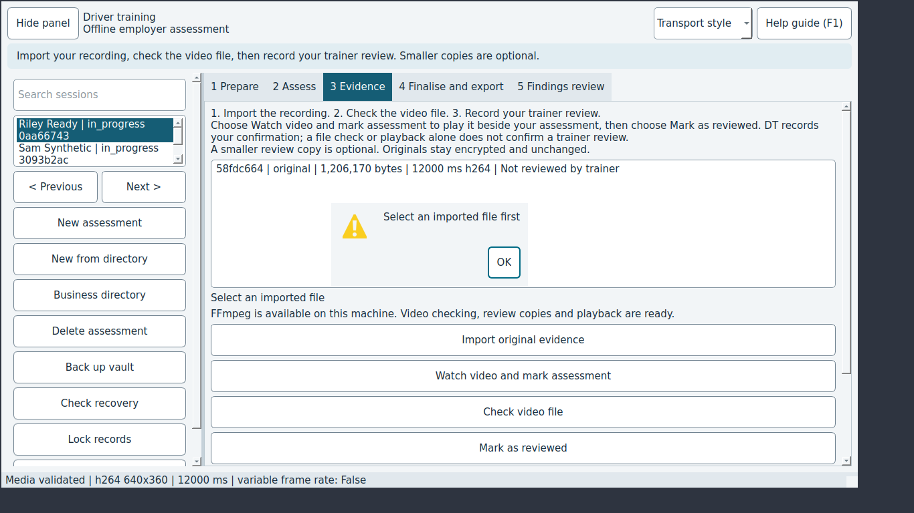

# JEV-0005: After Check video file finishes, the file selection is cleared, so the next evidence action fails

| | |
|---|---|
| Status | open |
| Severity / category | medium / ux |
| Classification | confirmed bug (confidence: confirmed) |
| Priority | 60.0 (rank 6) |
| Seen | 1 time(s) in 1 run(s); first 2026-09-29T06:09:19, last 2026-09-29T06:09:19 |
| Reported by | scenario |
| DT commits | 6ead5563ebbf |

## What happens

**Expected:** After the media check the same file stays selected and Watch video and mark assessment opens it.

**Actual:** The evidence list is rebuilt with nothing selected and the next button warns 'Select an imported file first'.

## Reproduce

1. Start DT with seed=sample (Jev seed/network options).
2. Select the row "Riley Ready"
3. Open the "3 Evidence" tab
4. Click "Import original evidence"
5. Type "drive-clip-12s-640x360.mp4" into "Path" and press Enter
6. Wait up to 30 s for the job to finish
7. Select the row "original"
8. Click "Check video file"
9. Click "Watch video and mark assessment"

Replay with Jev: `jev scenario run regressions/evidence-selection-after-check` (copy in `scenarios/JEV-0005.json`).

## Where to look

- dt/ui.py: MainWindow.analysis_complete -> refresh_sessions -> populate_session clears self.assets
- `dt/ui.py:1759` in `MainWindow.analysis_complete`: named in the issue: dt/ui.py: MainWindow.analysis_complete -> refresh_sessions -> populate_session clears self
- `dt/ui.py:1222` in `MainWindow.populate_session`: named in the issue: dt/ui.py: MainWindow.analysis_complete -> refresh_sessions -> populate_session clears self
- `dt/ui.py:1599` in `MainWindow.selected_asset`: error text 'Select an imported file first'
- `dt/application.py:206` in `AssessmentService.record_evidence_review`: error text 'Select an imported file first'
- `dt/ui.py:901` in `MainWindow.evidence_tab`: button text 'Watch video and mark assessment'

`dt/ui.py` around line 1759:

```python
 1759      def analysis_complete(self, message):
 1760          if self.closed or self.lock_requested:
 1761              return
 1762          if self.worker and self.worker.operation == "clip":
 1763              self.playback.clear_clips()
 1764          self.refresh_sessions(self.selected_session_id)
 1765          self.statusBar().showMessage(message)
 1766  
 1767      def selected_finding(self):
 1768          row = self.findings_list.currentRow()
 1769          findings = self.session.findings
 1770          if row < 0 or row >= len(findings):
 1771              raise ValueError("Select a finding first")
 1772          return findings[row]
 1773  
 1774      def refresh_findings(self):
 1775          session = self.session
```

`dt/ui.py` around line 1222:

```python
 1222      def populate_session(self):
 1223          self.loading = True
 1224          s = self.session
 1225          if self.playback_session_id != s.id:
 1226              self.playback.close()
 1227          values = {"driver_name": s.driver.get("name", ""), "driver_id": s.driver.get("internal_id", ""),
 1228                    "licence_class": s.driver.get("licence_class", ""), "licence_expiry": s.driver.get("licence_expiry", ""),
 1229                    **s.vehicle}
 1230          for key, widget in self.fields.items():
 1231              widget.setText(values.get(key, getattr(s, key, "")))
 1232              widget.setReadOnly(bool(s.signed_at))
 1233          self.licence_class.setCurrentText(s.driver.get("licence_class", ""))
 1234          self.jurisdiction.setCurrentText(s.jurisdictions[0])
 1235          for kind in ("truck", "trailer"):
 1236              self.vehicle_choices[f"{kind}_make"].setCurrentText(s.vehicle.get(f"{kind}_make", ""))
 1237              self.reload_models(kind)
 1238              self.vehicle_choices[f"{kind}_model"].setCurrentText(s.vehicle.get(f"{kind}_model", ""))
```

## Evidence



Runs: campaign-baseline/verify/JEV-0005-evidence-selection-after-check (scenario, scenario)

## Suggested DT regression test

tests/desktop/test_ui.py: import a fixture video, select it in window.assets, run 'Check video file' and wait for analysis_complete, then assert window.assets.currentRow() still points at the same file.

## Definition of done

1. The fix is on a DT branch with a DT regression test that fails without it.
2. `JEV_DT_PATH=<that checkout> jev verify --issue JEV-0005` passes.
3. The next `jev campaign` does not report it again.

## Task for a coding agent in the DT repository

```text
Fix JEV-0005 in DT: After Check video file finishes, the file selection is cleared, so the next evidence action fails.
Expected: After the media check the same file stays selected and Watch video and mark assessment opens it.
Actual: The evidence list is rebuilt with nothing selected and the next button warns 'Select an imported file first'.
Start from: dt/ui.py:1759 (MainWindow.analysis_complete), dt/ui.py:1222 (MainWindow.populate_session), dt/ui.py:1599 (MainWindow.selected_asset).
Work on a branch, follow DT's own AGENTS.md, and add a regression test that fails before the fix (tests/desktop/test_ui.py: import a fixture video, select it in window.assets, run 'Check video file' and wait for analysis_complete, then assert window.assets.currentRow() still points at the same file.).
Run DT's unit and desktop test suites before finishing.
```
