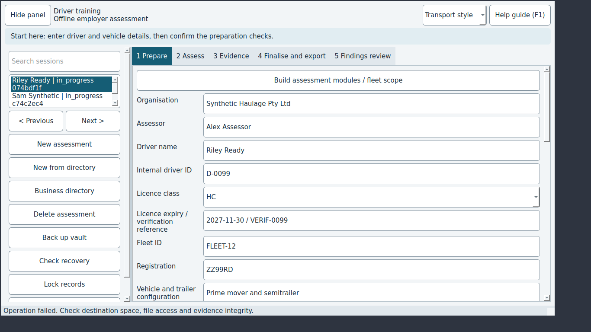

# JEV-0006: Backing up into the vault folder fails with a generic message that hides the reason

| | |
|---|---|
| Status | open |
| Severity / category | medium / ux |
| Classification | confirmed bug (confidence: confirmed) |
| Priority | 60.0 (rank 7) |
| Seen | 2 time(s) in 2 run(s); first 2026-09-29T06:07:20, last 2026-09-29T06:08:12 |
| Reported by | scenario |
| DT commits | 6ead5563ebbf |

## What happens

**Expected:** The status says 'Choose a backup location outside the active vault'.

**Actual:** The status says 'Operation failed. Check destination space, file access and evidence integrity.'

## Reproduce

1. Start DT with seed=sample (Jev seed/network options).
2. Select the row "Riley Ready"
3. Click "Check recovery"
4. Click "OK"
5. Click "Back up vault"
6. Click "Choose folder"
7. Wait up to 60 s
8. Check the screen
9. Click "OK"
10. Click "Back up vault"
11. Type "../vaults/seeded-vault" into "Path" and press Enter

Replay with Jev: `jev scenario run regressions/backup-error-reason` (copy in `scenarios/JEV-0006.json`).

## Where to look

- dt/ui.py: MaintenanceWorker.run replaces every exception with one generic message
- `dt/ui.py:143` in `MaintenanceWorker.run`: named in the issue: dt/ui.py: MaintenanceWorker.run replaces every exception with one generic message
- `dt/storage.py:569` in `Vault.backup`: error text 'Choose a backup location outside the active vault'
- `dt/ui.py:157` in `MaintenanceWorker.run`: string text 'Operation failed. Check destination space, file access and e'
- `dt/ui.py:1876` in `MainWindow.start_maintenance`: status text 'Verifying encrypted records and evidence...'

`dt/ui.py` around line 143:

```python
  143      def run(self):
  144          vault = None
  145          try:
  146              vault = self.parent_vault.worker_connection()
  147              if self.operation == "backup":
  148                  result = vault.backup(self.destination, cancel=self.isInterruptionRequested)
  149              elif self.operation == "recover":
  150                  result = {"recovered": vault.recover_import(self.destination, cancel=self.isInterruptionRequested)}
  151              else:
  152                  result = vault.recovery_report(verify=True, cancel=self.isInterruptionRequested)
  153              self.completed.emit(result)
  154          except ImportCancelled:
  155              self.failed.emit("Operation cancelled. Source records were not changed.")
  156          except Exception:
  157              self.failed.emit("Operation failed. Check destination space, file access and evidence integrity.")
  158          finally:
  159              if vault:
```

`dt/storage.py` around line 569:

```python
  564  
  565      @coordinated
  566      def backup(self, destination, *, cancel=None):
  567          destination = Path(destination).resolve()
  568          if destination == self.folder or self.folder in destination.parents:
  569              raise ValueError("Choose a backup location outside the active vault")
  570          if destination.exists():
  571              raise ValueError("Backup destination already exists")
  572          if self.recovery_report(verify=True, cancel=cancel)["invalid"]:
  573              raise ValueError("Repair missing or corrupt evidence before backup")
  574          temporary = Path(tempfile.mkdtemp(prefix=".dt-backup-", dir=destination.parent))
  575          try:
```

## Evidence



Runs: campaign-baseline/sweep/13-maintenance (scenario, scenario); campaign-baseline/verify/JEV-0006-backup-error-reason (scenario, scenario)

## Suggested DT regression test

tests/desktop/test_ui.py: run MaintenanceWorker (or start_maintenance) with a backup folder inside the vault and assert the message shown contains 'outside the active vault'.

## Definition of done

1. The fix is on a DT branch with a DT regression test that fails without it.
2. `JEV_DT_PATH=<that checkout> jev verify --issue JEV-0006` passes.
3. The next `jev campaign` does not report it again.

## Task for a coding agent in the DT repository

```text
Fix JEV-0006 in DT: Backing up into the vault folder fails with a generic message that hides the reason.
Expected: The status says 'Choose a backup location outside the active vault'.
Actual: The status says 'Operation failed. Check destination space, file access and evidence integrity.'
Start from: dt/ui.py:143 (MaintenanceWorker.run), dt/storage.py:569 (Vault.backup), dt/ui.py:157 (MaintenanceWorker.run).
Work on a branch, follow DT's own AGENTS.md, and add a regression test that fails before the fix (tests/desktop/test_ui.py: run MaintenanceWorker (or start_maintenance) with a backup folder inside the vault and assert the message shown contains 'outside the active vault'.).
Run DT's unit and desktop test suites before finishing.
```
