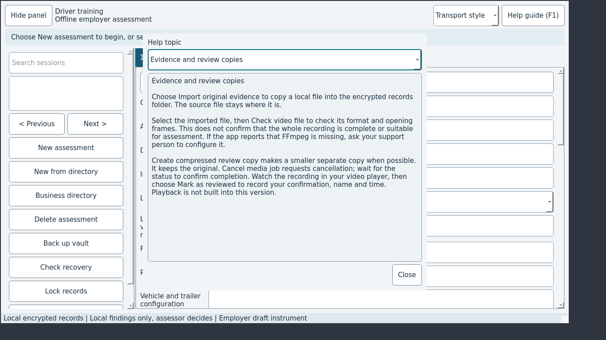

# JEV-0007: Help guide says video playback is not built in, but Evidence has in-app playback and clipping

| | |
|---|---|
| Status | open |
| Severity / category | medium / copy |
| Classification | confirmed bug (confidence: confirmed) |
| Priority | 60.0 (rank 8) |
| Seen | 1 time(s) in 1 run(s); first 2026-09-29T06:09:23, last 2026-09-29T06:09:23 |
| Reported by | scenario |
| DT commits | 6ead5563ebbf |

## What happens

**Expected:** The 'Evidence and review copies' topic describes Watch video and mark assessment, clipping and Install FFmpeg for video features.

**Actual:** It says 'Watch the recording in your video player ... Playback is not built into this version.' and to ask support to configure FFmpeg.

## Reproduce

1. Start DT with seed=empty (Jev seed/network options).
2. Press F1
3. Choose "Evidence and review copies" in "Help topic"
4. Check the screen

Replay with Jev: `jev scenario run regressions/help-playback-text` (copy in `scenarios/JEV-0007.json`).

## Where to look

- dt/help_guide.py: TOPICS['Evidence and review copies']
- `dt/help_guide.py:51` in ``: string text 'Evidence and review copies'
- `dt/help_guide.py:93` in ``: string text 'Evidence and review copies'
- `dt/help_guide.py:52` in ``: string text 'Playback is not built into this version'
- `dt/help_guide.py:103` in `HelpGuide.__init__`: label the control 'Help topic'

`dt/help_guide.py` around line 51:

```python
   46          "or intervention. Save mark and next moves to the next check.\n\n"
   47          + "\n\n".join(f"{mark.value}: {description}" for mark, description in MARK_DESCRIPTIONS.items())
   48          + "\n\nPrepared notes are starting points. Edit them to match what actually happened. "
   49          "For NA, record a reason; only checks that allow NA can be excluded."
   50      ),
   51      "Evidence and review copies": (
   52          "Choose Import original evidence to copy a local file into the encrypted records folder. "
   53          "The source file stays where it is.\n\n"
   54          "Select the imported file, then Check video file to check its format and opening frames. "
   55          "This does not confirm that the whole recording is complete or suitable for assessment. "
   56          "If the app reports that FFmpeg is missing, ask your support person to configure it.\n\n"
   57          "Create compressed review copy makes a smaller separate copy when possible. It keeps the original. "
```

`dt/help_guide.py` around line 93:

```python
   88          "Delete assessment requires confirmation and the vault passphrase. It can delete signed records "
   89          "and has no undo."
   90      ),
   91  }
   92  
   93  TAB_TOPICS = ("Prepare", "Assess and mark key", "Evidence and review copies",
   94                "Finalise and export", "Optional findings review")
   95  
   96  
   97  class HelpGuide(QDialog):
   98      def __init__(self, parent=None, topic="Getting started"):
   99          super().__init__(parent)
```

## Evidence



Runs: campaign-baseline/verify/JEV-0007-help-playback-text (scenario, scenario)

## Suggested DT regression test

tests/desktop/test_ui.py: assert TOPICS['Evidence and review copies'] does not say playback is missing, and that it names 'Watch video and mark assessment'.

## Definition of done

1. The fix is on a DT branch with a DT regression test that fails without it.
2. `JEV_DT_PATH=<that checkout> jev verify --issue JEV-0007` passes.
3. The next `jev campaign` does not report it again.

## Task for a coding agent in the DT repository

```text
Fix JEV-0007 in DT: Help guide says video playback is not built in, but Evidence has in-app playback and clipping.
Expected: The 'Evidence and review copies' topic describes Watch video and mark assessment, clipping and Install FFmpeg for video features.
Actual: It says 'Watch the recording in your video player ... Playback is not built into this version.' and to ask support to configure FFmpeg.
Start from: dt/help_guide.py:51 (), dt/help_guide.py:93 (), dt/help_guide.py:52 ().
Work on a branch, follow DT's own AGENTS.md, and add a regression test that fails before the fix (tests/desktop/test_ui.py: assert TOPICS['Evidence and review copies'] does not say playback is missing, and that it names 'Watch video and mark assessment'.).
Run DT's unit and desktop test suites before finishing.
```
