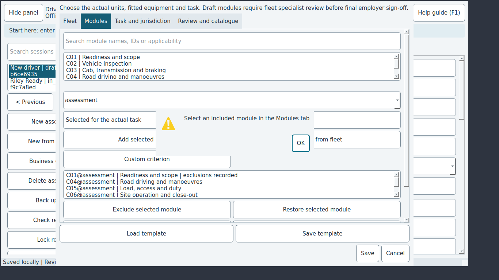

# JEV-0008: Module builder clears the module selection after excluding it, so Restore needs a reselect

| | |
|---|---|
| Status | open |
| Severity / category | low / ux |
| Classification | confirmed bug (confidence: confirmed) |
| Priority | 20.0 (rank 10) |
| Seen | 2 time(s) in 2 run(s); first 2026-09-29T06:07:00, last 2026-09-29T06:08:30 |
| Reported by | scenario |
| DT commits | 6ead5563ebbf |

## What happens

**Expected:** The excluded module stays selected, so Restore selected module works at once.

**Actual:** The selection is cleared; Restore warns 'Select an included module in the Modules tab'.

## Reproduce

1. Start DT with seed=sample (Jev seed/network options).
2. Click "New assessment"
3. Type "Alex Assessor" into "Assessor" and press Tab
4. Click "Build assessment modules / fleet scope"
5. Click "Add unit"
6. Type "rigid_1" into "Unit reference (e.g. trailer_1)"
7. Choose "rigid" in "Physical unit type"
8. Type "R-1" into "Fleet ID"
9. Click "OK" in the "Physical vehicle unit" window
10. Open the "Modules" tab
11. Click "Suggest from fleet"
12. Select the row "0"
13. Click "Exclude selected module"
14. Type "Not fitted" into "Why remove this check?"
15. Type "Fleet register" into "Unit / configuration evidence"
16. Click "OK" in the "Record scope exclusion" window
17. Click "Restore selected module"

Replay with Jev: `jev scenario run regressions/builder-restore-selection` (copy in `scenarios/JEV-0008.json`).

## Where to look

- dt/assessment_ui.py: AssessmentBuilder.refresh rebuilds lists without restoring the current row
- `dt/assessment_ui.py:235` in `AssessmentBuilder.refresh`: named in the issue: dt/assessment_ui.py: AssessmentBuilder.refresh rebuilds lists without restoring the curren
- `dt/assessment_ui.py:374` in `AssessmentBuilder.selected_scope`: error text 'Select an included module in the Modules tab'
- `dt/assessment_ui.py:184` in `AssessmentBuilder.build_modules_tab`: button text 'Restore selected module'

`dt/assessment_ui.py` around line 235:

```python
  235      def refresh(self):
  236          self.units.clear()
  237          self.units.addItems([f"{u['id']} | {u['kind']} | {u.get('fleet_id') or u.get('registration')}" for u in self.scope["units"]])
  238          self.connections.clear()
  239          self.connections.addItems([f"{c['id']} | {c['from_unit']} → {c['to_unit']} | {c['kind']}" for c in self.scope["connections"]])
  240          self.selections.clear()
  241          for selection in self.scope["selections"]:
  242              excluded = any(c["id"] + "@" + selection["binding"] in self.scope["exclusions"] for c in selection["module"]["criteria"])
  243              self.selections.addItem(selection_key(selection) + " | " + selection["module"]["title"] + (" | exclusions recorded" if excluded else ""))
  244          self.binding.clear()
  245          self.binding.addItems(["assessment"] + [u["id"] for u in self.scope["units"]] + [c["id"] for c in self.scope["connections"]])
  246          self.jurisdictions.clear()
  247          self.jurisdictions.addItems([j["code"] + " | " + (j.get("source") or "Not verified") for j in self.scope["jurisdictions"]])
  248          self.filter_modules()
  249  
  250      def filter_modules(self):
  251          query = self.search.text().casefold()
```

`dt/assessment_ui.py` around line 374:

```python
  369          self.review_scope()
  370  
  371      def selected_scope(self):
  372          index = self.selections.currentRow()
  373          if index < 0:
  374              raise ValueError("Select an included module in the Modules tab")
  375          return self.scope["selections"][index]
  376  
  377      def exclude_selection(self):
  378          selection = self.selected_scope()
  379          detail = exclusion_dialog(self)
  380          if detail is None:
```

## Evidence



Runs: campaign-baseline/sweep/12-module-builder (scenario, scenario); campaign-baseline/verify/JEV-0008-builder-restore-selection (scenario, scenario)

## Suggested DT regression test

tests/desktop/test_assessment_ui.py: select a module in the builder's module list, exclude it, assert the list keeps it selected, and assert 'Restore selected module' restores it without reselecting.

## Definition of done

1. The fix is on a DT branch with a DT regression test that fails without it.
2. `JEV_DT_PATH=<that checkout> jev verify --issue JEV-0008` passes.
3. The next `jev campaign` does not report it again.

## Task for a coding agent in the DT repository

```text
Fix JEV-0008 in DT: Module builder clears the module selection after excluding it, so Restore needs a reselect.
Expected: The excluded module stays selected, so Restore selected module works at once.
Actual: The selection is cleared; Restore warns 'Select an included module in the Modules tab'.
Start from: dt/assessment_ui.py:235 (AssessmentBuilder.refresh), dt/assessment_ui.py:374 (AssessmentBuilder.selected_scope), dt/assessment_ui.py:184 (AssessmentBuilder.build_modules_tab).
Work on a branch, follow DT's own AGENTS.md, and add a regression test that fails before the fix (tests/desktop/test_assessment_ui.py: select a module in the builder's module list, exclude it, assert the list keeps it selected, and assert 'Restore selected module' restores it without reselecting.).
Run DT's unit and desktop test suites before finishing.
```
