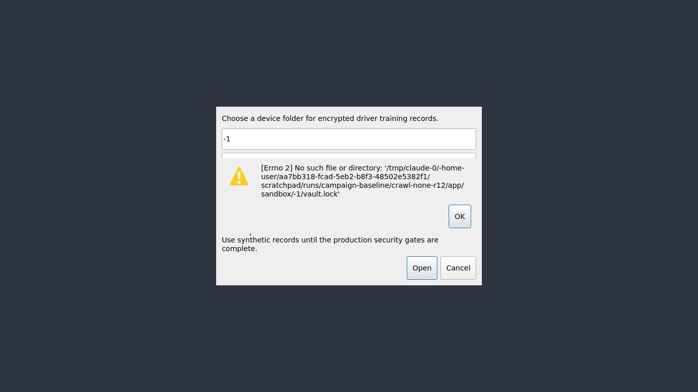

# JEV-0009: The unlock dialog shows raw system errors ([Errno 2] No such file or directory, [Errno 36] File name too long)

| | |
|---|---|
| Status | open |
| Severity / category | medium / copy |
| Classification | ux issue (confidence: confirmed) |
| Priority | 75.0 (rank 4) |
| Seen | 7 time(s) in 2 run(s); first 2026-09-29T06:09:37, last 2026-09-29T06:11:32 |
| Reported by | crawler, scenario |
| DT commits | 6ead5563ebbf |

## What happens

**Expected:** A plain message such as 'No vault in this folder. Tick Create a new vault to make one here.', or 'This folder name is too long'.

**Actual:** 'Could not open records' shows Python's OSError text with the full path, e.g. [Errno 2] No such file or directory: '<folder>/vault.lock'.

## Reproduce

1. Start DT with seed=none, network=mock (Jev seed/network options).
2. Type "no-such-folder" into "Choose a device folder for encrypted driver training records."
3. Type "jev-synthetic-passphrase-2026" into "Vault passphrase" and press Enter
4. Click "OK"
5. Type "very-long-folder-name-xxxxxxxxxxxxxxxxxxxxxxxxxxxxxxxxxxxxxxxxxxxxxxxxxxxxxxxxxx" into "Choose a device folder for encrypted driver training records."
6. Type "jev-synthetic-passphrase-2026" into "Vault passphrase" and press Enter

Replay with Jev: `jev scenario run regressions/unlock-raw-os-error` (copy in `scenarios/JEV-0009.json`).

## Where to look

- dt/ui.py: UnlockDialog.unlock shows str(error) for every exception, including OSError from Vault()
- `dt/ui.py:198` in `UnlockDialog.unlock`: named in the issue: dt/ui.py: UnlockDialog.unlock shows str(error) for every exception, including OSError from
- `dt/ui.py:206` in `UnlockDialog.unlock`: title text 'Could not open records'
- `dt/ui.py:181` in `UnlockDialog.__init__`: placeholder text 'Vault passphrase'
- `dt/ui.py:183` in `UnlockDialog.__init__`: checkbox the control 'Create a new vault in an empty folder'
- `dt/ui.py:170` in `UnlockDialog.__init__`: label the control 'Choose a device folder for encrypted driver training records.'

`dt/ui.py` around line 198:

```python
  198      def unlock(self):
  199          try:
  200              if not self.folder.text().strip():
  201                  raise ValueError("Choose a local folder")
  202              self.vault = Vault(self.folder.text(), self.password.text(), create=self.create.isChecked())
  203              self.password.clear()
  204              self.accept()
  205          except Exception as error:
  206              QMessageBox.warning(self, "Could not open records", str(error))
  207  
  208  
  209  class BusinessDirectoryDialog(QDialog):
  210      """Company brief, division folders and driver records held in the encrypted directory."""
  211  
  212      def __init__(self, vault, actor, parent=None):
  213          super().__init__(parent)
  214          self.vault = vault
```

`dt/ui.py` around line 206:

```python
  201                  raise ValueError("Choose a local folder")
  202              self.vault = Vault(self.folder.text(), self.password.text(), create=self.create.isChecked())
  203              self.password.clear()
  204              self.accept()
  205          except Exception as error:
  206              QMessageBox.warning(self, "Could not open records", str(error))
  207  
  208  
  209  class BusinessDirectoryDialog(QDialog):
  210      """Company brief, division folders and driver records held in the encrypted directory."""
  211  
  212      def __init__(self, vault, actor, parent=None):
```

## Evidence



Runs: campaign-baseline/crawl-none-r12 (crawl, crawler); campaign-baseline/verify/JEV-0009-unlock-raw-os-error (scenario, scenario)

## Suggested DT regression test

tests/desktop/test_ui.py: UnlockDialog with a folder that does not exist and Create unticked: patch QMessageBox.warning, call unlock(), and assert the message does not contain 'Errno' and tells the user to tick Create or choose the vault folder.

## Definition of done

1. The fix is on a DT branch with a DT regression test that fails without it.
2. `JEV_DT_PATH=<that checkout> jev verify --issue JEV-0009` passes.
3. The next `jev campaign` does not report it again.

## Task for a coding agent in the DT repository

```text
Fix JEV-0009 in DT: The unlock dialog shows raw system errors ([Errno 2] No such file or directory, [Errno 36] File name too long).
Expected: A plain message such as 'No vault in this folder. Tick Create a new vault to make one here.', or 'This folder name is too long'.
Actual: 'Could not open records' shows Python's OSError text with the full path, e.g. [Errno 2] No such file or directory: '<folder>/vault.lock'.
Start from: dt/ui.py:198 (UnlockDialog.unlock), dt/ui.py:206 (UnlockDialog.unlock), dt/ui.py:181 (UnlockDialog.__init__).
Work on a branch, follow DT's own AGENTS.md, and add a regression test that fails before the fix (tests/desktop/test_ui.py: UnlockDialog with a folder that does not exist and Create unticked: patch QMessageBox.warning, call unlock(), and assert the message does not contain 'Errno' and tells the user to tick Create or choose the vault folder.).
Run DT's unit and desktop test suites before finishing.
```
