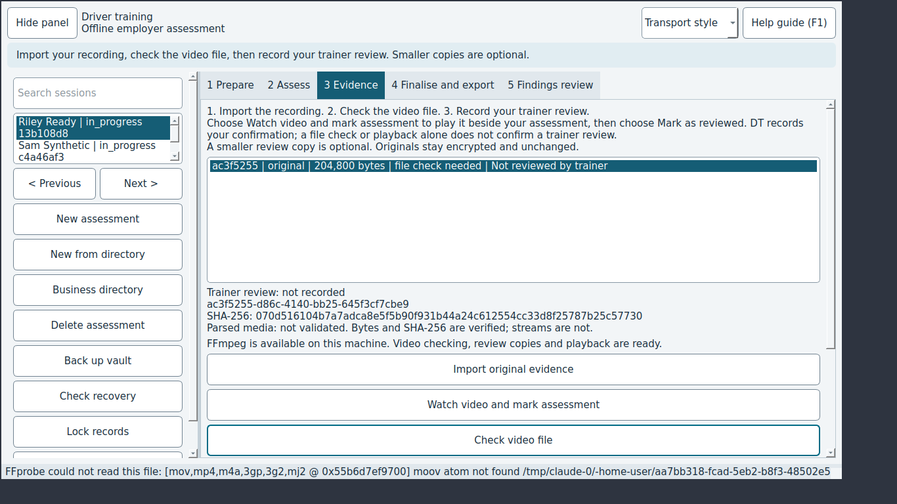

# JEV-0010: Checking a damaged video shows raw FFprobe output (moov atom not found, memory addresses, internal paths)

| | |
|---|---|
| Status | open |
| Severity / category | medium / copy |
| Classification | ux issue (confidence: confirmed) |
| Priority | 60.0 (rank 9) |
| Seen | 3 time(s) in 2 run(s); first 2026-09-29T06:05:11, last 2026-09-29T06:08:19 |
| Reported by | scenario |
| DT commits | 6ead5563ebbf |

## What happens

**Expected:** A plain message such as 'This file is not a playable video; it may be incomplete or damaged. Import the original recording again.', with the tool output kept for diagnostics.

**Actual:** The status bar shows 'FFprobe could not read this file: [mov,mp4,... @ 0x55e5...] moov atom not found <vault>/work/<id>.mp4: Invalid data found when processing input'.

## Reproduce

1. Start DT with seed=sample, network=mock (Jev seed/network options).
2. Select the row "Riley Ready"
3. Open the "3 Evidence" tab
4. Click "Import original evidence"
5. Type "random-bytes.mp4" into "Path" and press Enter
6. Wait up to 20 s for the job to finish
7. Select the row "204,800 bytes"
8. Click "Check video file"

Replay with Jev: `jev scenario run regressions/broken-video-raw-ffprobe` (copy in `scenarios/JEV-0010.json`).

## Where to look

- dt/media.py: probe_media raises MediaToolError('FFprobe could not read this file: ' + error_tail(stderr)), and the UI shows that text as is
- `dt/media.py:237` in `probe_media`: named in the issue: dt/media.py: probe_media raises MediaToolError('FFprobe could not read this file: ' + erro
- `dt/media.py:166` in `error_tail`: named in the issue: dt/media.py: probe_media raises MediaToolError('FFprobe could not read this file: ' + erro
- `dt/media.py:243` in `probe_media`: string text 'FFprobe could not read this file: [mov,mp4,... @ 0x55e5...] '
- `dt/ui.py:902` in `MainWindow.evidence_tab`: button text 'Check video file'

`dt/media.py` around line 237:

```python
  237  def probe_media(path, *, tools=None, cancel=None):
  238      tools = tools or media_tools(cancel=cancel)
  239      result = run_tool([str(tools.ffprobe), "-hide_banner", "-v", "error", *NETWORK_DENIAL,
  240                         "-print_format", "json", "-show_format", "-show_streams", "-i", str(path)],
  241                        timeout=PROBE_TIMEOUT_SECONDS, work_dir=work_directory(path), cancel=cancel)
  242      if result.returncode:
  243          raise MediaToolError("FFprobe could not read this file: " + error_tail(result.stderr))
  244      try:
  245          report = json.loads(result.stdout or b"{}")
  246      except (json.JSONDecodeError, UnicodeDecodeError, RecursionError) as error:
  247          raise MediaToolError("FFprobe returned an unreadable report") from error
  248      return summarise_report(report)
  249  
  250  
  251  def verify_decodable(path, *, tools=None, seconds=DECODE_CHECK_SECONDS, cancel=None):
  252      """Decode the opening seconds so a validated asset is more than a readable header."""
  253      tools = tools or media_tools(cancel=cancel)
```

`dt/media.py` around line 166:

```python
  166  def error_tail(stream_bytes):
  167      return safe_text(stream_bytes[-ERROR_TAIL_BYTES:].decode("utf-8", "replace").replace("\n", " "), 400)
  168  
  169  
  170  def ratio_to_float(value):
  171      try:
  172          numerator, _, denominator = str(value).partition("/")
  173          divisor = int(denominator or 1)
  174          return round(int(numerator) / divisor, 3) if divisor else 0.0
  175      except (TypeError, ValueError):
  176          return 0.0
  177  
  178  
  179  def stream_rotation(video):
  180      for side_data in video.get("side_data_list") or []:
  181          if "rotation" in side_data:
  182              try:
```

## Evidence



Runs: campaign-baseline/sweep/06-evidence (scenario, scenario); campaign-baseline/verify/JEV-0010-broken-video-raw-ffprobe (scenario, scenario)

## Suggested DT regression test

tests/test_media.py: make ffprobe fail on a random-bytes file and assert the MediaToolError text shown to users has no '@ 0x', no work-folder path and no 'moov atom'.

## Definition of done

1. The fix is on a DT branch with a DT regression test that fails without it.
2. `JEV_DT_PATH=<that checkout> jev verify --issue JEV-0010` passes.
3. The next `jev campaign` does not report it again.

## Task for a coding agent in the DT repository

```text
Fix JEV-0010 in DT: Checking a damaged video shows raw FFprobe output (moov atom not found, memory addresses, internal paths).
Expected: A plain message such as 'This file is not a playable video; it may be incomplete or damaged. Import the original recording again.', with the tool output kept for diagnostics.
Actual: The status bar shows 'FFprobe could not read this file: [mov,mp4,... @ 0x55e5...] moov atom not found <vault>/work/<id>.mp4: Invalid data found when processing input'.
Start from: dt/media.py:237 (probe_media), dt/media.py:166 (error_tail), dt/media.py:243 (probe_media).
Work on a branch, follow DT's own AGENTS.md, and add a regression test that fails before the fix (tests/test_media.py: make ffprobe fail on a random-bytes file and assert the MediaToolError text shown to users has no '@ 0x', no work-folder path and no 'moov atom'.).
Run DT's unit and desktop test suites before finishing.
```
